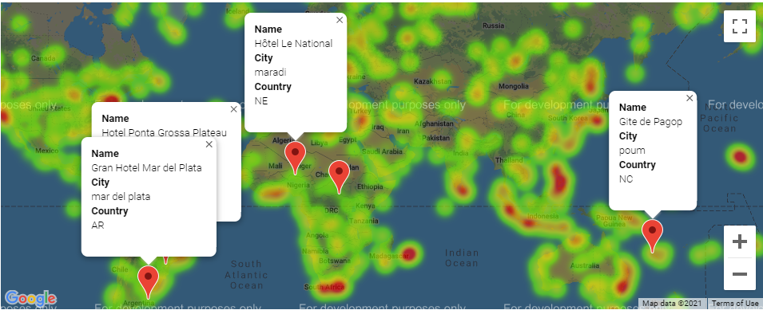

# What's the Weather Like?

## Background

Using Python requests, APIs, and JSON traversals, the fundamental question will attempt to be answered: "What's the weather like as we approach the equator?"

Now, we know what you may be thinking: _"Duh. It gets hotter..."_

But, if pressed, how would you **prove** it?

## Part I

A Python script is created to visualize the weather of 500+ cities across the world of varying distance from the equator. To accomplish this, the [simple Python library](https://pypi.python.org/pypi/citipy), the [OpenWeatherMap API](https://openweathermap.org/api), and a little common sense are utilized to create a representative model of weather across world cities.

The first requirement is to create a series of scatter plots to showcase the following relationships:

* Temperature (F) vs. Latitude
* Humidity (%) vs. Latitude
* Cloudiness (%) vs. Latitude
* Wind Speed (mph) vs. Latitude

The second requirement is to run linear regression on each relationship. This time, the plots are separated into Northern Hemisphere (greater than or equal to 0 degrees latitude) and Southern Hemisphere (less than 0 degrees latitude):

* Northern Hemisphere - Temperature (F) vs. Latitude
* Southern Hemisphere - Temperature (F) vs. Latitude
* Northern Hemisphere - Humidity (%) vs. Latitude
* Southern Hemisphere - Humidity (%) vs. Latitude
* Northern Hemisphere - Cloudiness (%) vs. Latitude
* Southern Hemisphere - Cloudiness (%) vs. Latitude
* Northern Hemisphere - Wind Speed (mph) vs. Latitude
* Southern Hemisphere - Wind Speed (mph) vs. Latitude

The final notebook contains:

* Randomly selected **at least** 500 unique (non-repeat) cities based on latitude and longitude.
* Performs a weather check on each of the cities using a series of successive API calls.
* Includes a print log of each city as it's being processed with the city number and city name.
* Saves a CSV of all retrieved data and a PNG image for each scatter plot.

### Part II - VacationPy

 Using the data accumulated in the previous notebook, qualifications for the ideal vacation area and hotels will be found.

* Create a heat map that displays the humidity for every city from Part I.

* Narrow down the DataFrame to find the ideal weather condition. For example:

  * A max temperature lower than 80 degrees but higher than 70.

  * Wind speed less than 10 mph.

  * Zero cloudiness.

* Using Google Places API, the first hotel for each city located within 5000 meters of the desired coordinates is found.

* The hotels are plotted on top of the humidity heatmap with each pin containing the **Hotel Name**, **City**, and **Country**.

  

* Further analysis is commented in each notebook.